# Module Connection Tree (ID Bazli)

Tarih: 2026-04-25

```mermaid
graph TD
    SubModule[SubModule] --> ModuleManager[ModuleManager]
    ModuleManager --> ModuleRegistry[ModuleRegistry]
    ModuleManager --> CAT1[Core/Memory]
    CAT1 --> M_WorldMemory[WorldMemory]
    ModuleManager --> CAT2[Core/Neural]
    CAT2 --> M_NervousSystem[NervousSystem]
    ModuleManager --> CAT3[Intelligence/AI]
    CAT3 --> M_StaticDataCache[StaticDataCache]
    ModuleManager --> CAT4[Intelligence/Narrative]
    CAT4 --> M_NarrativeSystem[NarrativeSystem]
    ModuleManager --> CAT5[Intelligence/Swarm]
    CAT5 --> M_SwarmCoordinator[SwarmCoordinator]
    ModuleManager --> CAT6[Systems/AI]
    CAT6 --> M_AdaptiveA_DoctrineSystem[AdaptiveAIDoctrineSystem]
    ModuleManager --> CAT7[Systems/Behavior]
    CAT7 --> M_WarlordBehaviorSystem[WarlordBehaviorSystem]
    ModuleManager --> CAT8[Systems/Bounty]
    CAT8 --> M_BountySystem[BountySystem]
    ModuleManager --> CAT9[Systems/Cleanup]
    CAT9 --> M_CleanupSystem[CleanupSystem]
    CAT9 --> M_ConsolidationSystem[ConsolidationSystem]
    ModuleManager --> CAT10[Systems/Combat]
    CAT10 --> M_MilitiaMoraleSystem[MilitiaMoraleSystem]
    ModuleManager --> CAT11[Systems/Crisis]
    CAT11 --> M_CrisisEvents[CrisisEvents]
    ModuleManager --> CAT12[Systems/Dev]
    CAT12 --> M_DevDataCollector[DevDataCollector]
    ModuleManager --> CAT13[Systems/Diagnostics]
    CAT13 --> M_MilitiaAssertionSystem[MilitiaAssertionSystem]
    ModuleManager --> CAT14[Systems/Diplomacy]
    CAT14 --> M_BanditPoliticsSystem[BanditPoliticsSystem]
    ModuleManager --> CAT15[Systems/Economy]
    CAT15 --> M_CaravanTaxSystem[CaravanTaxSystem]
    CAT15 --> M_WarlordEconomy[WarlordEconomy]
    ModuleManager --> CAT16[Systems/Enhancement]
    CAT16 --> M_WarlordTacticsSystem[WarlordTacticsSystem]
    ModuleManager --> CAT17[Systems/Events]
    CAT17 --> M_JailbreakMissionSystem[JailbreakMissionSystem]
    ModuleManager --> CAT18[Systems/Fear]
    CAT18 --> M_FearSystem[FearSystem]
    ModuleManager --> CAT19[Systems/Grid]
    CAT19 --> M_SpatialGrid[SpatialGrid]
    ModuleManager --> CAT20[Systems/Legacy]
    CAT20 --> M_WarlordLegacy[WarlordLegacy]
    ModuleManager --> CAT21[Systems/Logistics]
    CAT21 --> M_WarlordLogisticsSystem[WarlordLogisticsSystem]
    ModuleManager --> CAT22[Systems/Progression]
    CAT22 --> M_AscensionEvaluator[AscensionEvaluator]
    CAT22 --> M_MilitiaProgressionSystem[MilitiaProgressionSystem]
    CAT22 --> M_MilitiaUpgradeSystem_LEGACY[MilitiaUpgradeSystem_LEGACY]
    CAT22 --> M_TroopProgressionSystem_LEGACY[TroopProgressionSystem_LEGACY]
    CAT22 --> M_WarlordCareer[WarlordCareer]
    CAT22 --> M_WarlordSuccessionSystem[WarlordSuccessionSystem]
    ModuleManager --> CAT23[Systems/Raiding]
    CAT23 --> M_MilitiaRaidSystem[MilitiaRaidSystem]
    ModuleManager --> CAT24[Systems/Scheduling]
    CAT24 --> M_A_Scheduler[AIScheduler]
    ModuleManager --> CAT25[Systems/Seasonal]
    CAT25 --> M_SeasonalEffectsSystem[SeasonalEffectsSystem]
    ModuleManager --> CAT26[Systems/Spawning]
    CAT26 --> M_HardcoreDynamicHideoutSystem[HardcoreDynamicHideoutSystem]
    CAT26 --> M_SpawningSystem[SpawningSystem]
    ModuleManager --> CAT27[Systems/Territory]
    CAT27 --> M_Territory_nfluence[TerritoryInfluence]
    ModuleManager --> CAT28[Systems/Workshop]
    CAT28 --> M_WarlordWorkshopSystem[WarlordWorkshopSystem]
```

## Bagimlilik Kenarlari (ornek)
Asagidaki kenarlar kod icinden otomatik yakalanan ornek bagimliliklardir (TryGetEnabled/GetModule/Instance).

| Module ID | Bagimliliklar |
|---|---|
| AdaptiveAIDoctrineSystem | AdaptiveAIDoctrineSystem, EventBus, MilitiaEquipmentManager, NeuralEventRouter, PlayerTracker, WarlordLegitimacySystem, WarlordSystem, WarlordTacticsSystem |
| AIScheduler | AISchedulerSystem, DevDataCollector |
| AscensionEvaluator | BlackMarketSystem, BountySystem, EventBus, FearSystem, WarlordCareerSystem, WarlordEconomySystem, WarlordSystem |
| BanditPoliticsSystem | BountySystem, EventBus, NeuralEventRouter, WarlordSystem |
| BountySystem | EventBus, NeuralEventRouter, WarlordSystem |
| CaravanTaxSystem | FearSystem, SpatialGridSystem, WarlordSystem |
| CleanupSystem | DevDataCollector, EventBus, MilitiaConsolidationSystem, MilitiaSmartCache, NeuralEventRouter, PartyCleanupSystem, WarlordLegitimacySystem, WarlordSystem |
| ConsolidationSystem | FearSystem, WarlordLegitimacySystem, WarlordSystem |
| CrisisEvents | BountySystem, EventBus, NeuralEventRouter, SpatialGridSystem, WarlordSystem |
| DevDataCollector | AISchedulerSystem, BanditBrain, DevDataCollector, EventBus, SettlementDistanceCache, SpatialGridSystem, StaticDataCache, WarlordEconomySystem, WarlordLegitimacySystem |
| FearSystem | EventBus, NeuralEventRouter, WarlordSystem |
| HardcoreDynamicHideoutSystem | BindingFlags, EventBus |
| JailbreakMissionSystem | WarlordSystem |
| MilitiaAssertionSystem | EventBus, MilitiaAssertionSystem, PartyCleanupSystem, WarlordEconomySystem, WarlordSystem |
| MilitiaMoraleSystem | SeasonalEffectsSystem, WarlordCareerSystem, WarlordSystem |
| MilitiaProgressionSystem | WarlordSystem |
| MilitiaRaidSystem | EventBus, FearSystem, NeuralEventRouter, SeasonalEffectsSystem, WarlordLegitimacySystem, WarlordSystem |
| MilitiaUpgradeSystem_LEGACY | MilitiaProgressionSystem |
| NarrativeSystem | EventBus, WarlordLegitimacySystem, WarlordSystem |
| NervousSystem | AISchedulerSystem, FearSystem, NervousSystem, NeuralAdvisor, NeuralEventRouter, PlayerTracker, WarlordLogisticsSystem, WarlordSystem |
| SpawningSystem | AISchedulerSystem, BindingFlags, CaravanActivityTracker, DevDataCollector, EventBus, MBObjectManager, MilitiaSpawningSystem, SystemWatchdog, WarActivityTracker, WarlordCareerSystem, WarlordSystem |
| StaticDataCache | SettlementDistanceCache, StaticDataCache |
| SwarmCoordinator | EventBus, MilitiaSmartCache, SpatialGridSystem, WarlordSystem |
| TerritoryInfluence | EventBus, NeuralEventRouter, WarlordSystem |
| TroopProgressionSystem_LEGACY | MilitiaProgressionSystem |
| WarlordBehaviorSystem | EventBus, WarlordCareerSystem, WarlordSystem |
| WarlordCareer | AscensionEvaluator, BanditEnhancementSystem, BlackMarketSystem, EventBus, FearSystem, NeuralEventRouter, WarlordLegitimacySystem, WarlordSystem, WarlordWorkshopSystem |
| WarlordEconomy | BanditEnhancementSystem, MBObjectManager, NeuralEventRouter, WarlordCareerSystem, WarlordLegitimacySystem, WarlordSystem, WarlordWorkshopSystem |
| WarlordLegacy | EventBus, NeuralEventRouter |
| WarlordLogisticsSystem | BanditEnhancementSystem, MBObjectManager, WarlordSystem |
| WarlordSuccessionSystem | EventBus, WarlordCareerSystem, WarlordSystem |
| WarlordTacticsSystem | WarlordCareerSystem, WarlordEconomySystem, WarlordSystem, WarlordTacticsSystem |
| WarlordWorkshopSystem | EventBus, NeuralEventRouter, WarlordSystem |
| WorldMemory | EventBus |
