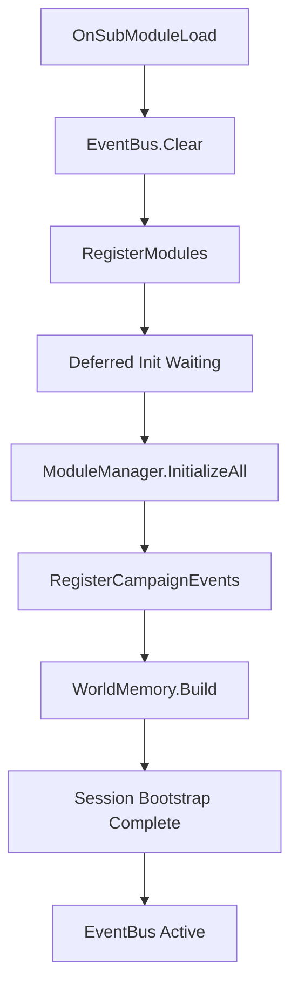
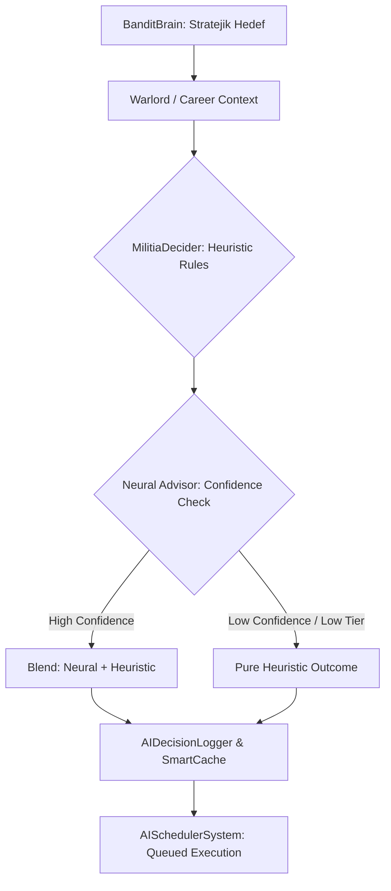
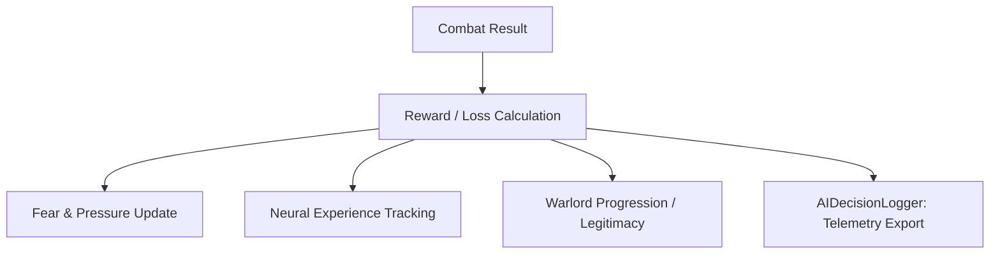
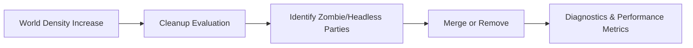

# Bandit Militias: WARLORD - Sistem Akışı

Bu belge, modun ana veri ve olay akışını yüksek seviyede özetler.

## 1. Aktivasyon ve Başlatma Kapısı

Modun tüm olay zinciri oyun açıldığı anda başlamaz. Ağır sistemler önce ertelemeli (deferred) aşamaya alınır, ardından bootstrap tamamlanınca `EventBus` tam olarak aktifleşir.

## 2. Karar Akışı: Hibrid AI Karar Zinciri

Yüksek seviyeli kararlar artık hibrid (Heuristic + Neural) bir hiyerarşiden geçerek uygulanır.

### Karar Katmanları:
- **Heuristic**: `MilitiaDecider` içindeki role-bazlı (Guardian, Raider vb.) kurallar.
- **Neural Advisor**: Saf C# ağı üzerinden gelen olasılık tavsiyesi.
- **SmartCache**: Performans için benzer kararların kısa süreli önbelleğe alınması.
- **AIScheduler**: Kararların zamana yayılarak CPU yükünün dengelenmesi.

## 3. Savaş Sonrası ve Geri Bildirim

Bir savaşın etkisi birden fazla sisteme paralel olarak akar:

## 4. Dünya Hafızası (WorldMemory) Akışı

Karar vericiler veriyi doğrudan oyun motorundan çekmek yerine üç katmanlı hafızadan beslenir:

- **Bedrock (Katman 1)**: Statik coğrafya, yerleşim yerleri ve kNN (en yakın komşu) grafiği.
- **Geology (Katman 2)**: Bölgesel refah, sahiplik ve ekonomik güç verileri (7 günlük periyot).
- **Weather (Katman 3)**: Hareketli kervanlar, lord partileri ve anlık yoğunluk (6 saatlik periyot).

## 5. Temizlik ve Performans (Cleanup)

---
*Son Güncelleme: Nisan 2026*

## Module ID Baglanti Agaci (Guncel)
Detayli modul-id seviyesinde baglanti agaci icin:
- `Documentation/ModuleConnectionTree_TR.md`
- `Documentation/Module_ID_Assessment_TR.md`
- `ModuleCodeExports/ModuleID_*.txt`
