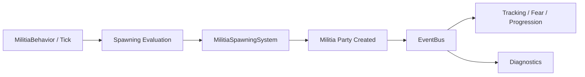
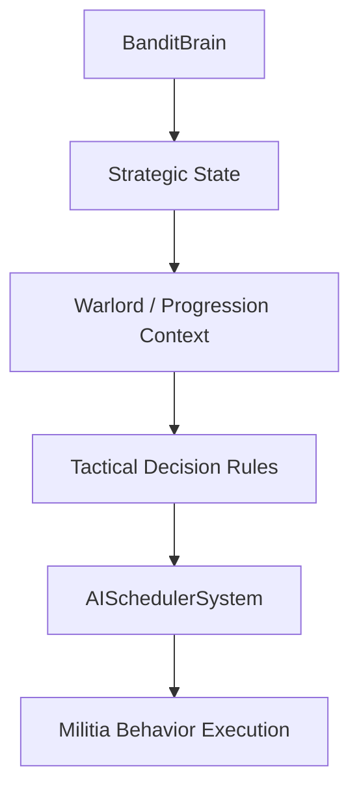
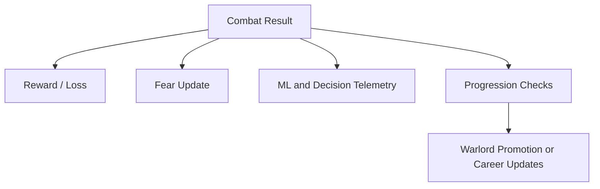
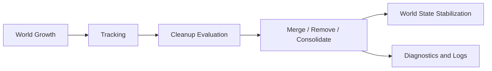

# Bandit Militias: WARLORD - Sistem Akışı

Bu belge, modun ana veri ve olay akışını yüksek seviyede özetler. Buradaki amaç tek tek tüm event tiplerini listelemek değil; modun hangi katmanda düşünüp hangi katmanda harekete geçtiğini görünür kılmaktır.

## Temel Prensip

Proje, mümkün olduğunca olay tabanlı ve modüler ilerler.

- davranış katmanı oyundan sinyal alır
- stratejik ve sistem katmanı karar üretir
- uygulama katmanı parti, ekonomi, korku veya cleanup gibi alanlara bu kararları dağıtır
- diagnostik katman olan biteni log ve test hub üzerinden görünür kılar

Bu ayrım, tüm işin tek bir sınıfa yığılmasını önler.

## Ana Akış 1: Spawn ve İlk Kayıt

Yeni bir milis partisinin sisteme girişi tipik olarak şu akıştan geçer:

Bu aşamada amaç sadece parti doğurmak değildir. Yeni partinin sistem tarafından izlenebilir ve yönetilebilir hale gelmesi gerekir.

## Ana Akış 2: Strateji ve Saha Kararı

Yüksek seviyeli kararlar, doğrudan tek bir emir yerine birkaç katmandan geçerek uygulanır.

Bu hatta özellikle şu katmanlar önemlidir:

- `BanditBrain`: genel baskı ve yön tayini
- `Progression` sistemleri: partinin veya warlord hattının bağlamı
- taktik karar kuralları: kaç, saldır, birleş, devriye gibi alan kararları
- `AISchedulerSystem`: kararları zamana yayma

## Ana Akış 3: Savaş Sonrası Etki

Bir savaşın etkisi sadece kazanan ve kaybedene yazılmaz. Korku, ekonomi, veri toplama ve progression gibi başka hatlara da akar.

Burada sistem tasarımı açısından önemli nokta, tek bir savaş sonucunun birden fazla alt sistemi aynı anda beslemesidir.

## Ana Akış 4: Temizlik ve Kararlılık

Uzun süreli testlerde dünya yükü arttıkça cleanup hattı devreye girer.

Bu akışın hedefi:

- zayıf veya bozulmuş partileri azaltmak
- gereksiz dünya yükünü düşürmek
- uzun oturumlarda performansın tamamen dağılmasını önlemek

## Runtime Diagnostics Akışı

Projede klasik log yaklaşımına ek olarak oyun içi test ve tanılama akışı da vardır.

Temel komutlar:

- `bandit.test_list`
- `bandit.test_run all`
- `bandit.test_report`

Bu komutlar, runtime test hub üzerinden şu tip sorunları görünür kılmak için kullanılır:

- ghost
- dead
- stale
- event leak
- cold module

Bu sayede sadece log okumak yerine oyun çalışırken doğrudan durum raporu alınabilir.

## Katmanlar Arası İlişki Özeti

En sade haliyle veri akışı şu düşünceyle okunabilir:

1. Oyun sinyal üretir.
2. Behavior ve tracking katmanı bu sinyali toplar.
3. Intelligence ve system katmanları karar üretir.
4. Scheduler ve execution katmanları bu kararı uygular.
5. Diagnostics katmanı sonucu görünür kılar.

## Neden Önemli?

Bu yapı, Bandit Militias'ı sadece yeni parti üreten bir mod olmaktan çıkarır. Asıl amaç:

- uzun oturumlarda veri toplayabilmek
- sorunları izole edebilmek
- davranış, ekonomi ve performans katmanlarını ayrı ayrı geliştirebilmek

Yani sistem akışı, modun hem oynanış tarafını hem de geliştirilebilirliğini belirleyen ana omurgadır.
